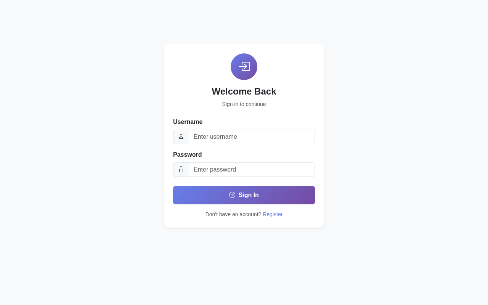

# 🔐 SecureAuth TOTP

> **Professional Two-Factor Authentication Web App** with QR Code Setup

A production-ready Express.js application featuring time-based one-time password (TOTP) authentication with a clean, modern Bootstrap 5 interface. Users scan a QR code with Google Authenticator, Authy, or any TOTP app to secure their accounts.


---

## ✨ Features

- 🔐 **TOTP 2FA** - Industry-standard two-factor authentication
- 📱 **QR Code Setup** - Easy scanning with Google Authenticator, Authy, Microsoft Authenticator
- 🔑 **Manual Entry** - Secret key copy option for manual setup
- 👥 **User Limits** - Configurable maximum user registration cap
- 🎨 **Modern UI** - Clean Bootstrap 5 design with custom styling
- 🔒 **Secure Passwords** - bcryptjs hashing with salt rounds
- 🚀 **Session Management** - Secure express-session with configurable timeout
- 📊 **Live Stats** - Dashboard shows active user count
- 🌐 **Cloudflare Ready** - Includes tunnel deployment script

---

## 🚀 Quick Start

### 1. Clone the Repository

```bash
git clone https://github.com/blaxkmiradev/Auth-qrcode.git
cd Auth-qrcode
```

### 2. Install Dependencies

```bash
npm install
```

### 3. Configure Environment

```bash
cp .env.example .env
```

Edit `.env` with your settings:

```env
SESSION_SECRET=your_super_secret_key_change_this
PORT=3000
NODE_ENV=production
MAX_USERS=10
```

### 4. Start the Server

```bash
npm start
```

Open **http://localhost:3000** in your browser.

---

## 📸 Screenshots

### Login Page


### Registration & QR Setup


### User Dashboard


---

## 🔄 User Flow

1. **Register** → Create account with username & password
2. **Scan QR** → Use authenticator app to scan the QR code
3. **Verify** → Enter the 6-digit code from your app
4. **Dashboard** → Successfully authenticated!
5. **Logout/Login** → TOTP code required on every login

---

## 🛠️ Tech Stack

| Technology | Purpose |
|------------|---------|
| **Express.js** | Web framework |
| **EJS** | Template engine |
| **Bootstrap 5** | UI framework |
| **speakeasy** | TOTP generation & verification |
| **qrcode** | QR code generation |
| **bcryptjs** | Password hashing |
| **express-session** | Session management |

---

## ⚙️ Configuration

### Environment Variables

| Variable | Default | Description |
|----------|---------|-------------|
| `SESSION_SECRET` | `supersecretkey` | Session encryption key |
| `PORT` | `3000` | Server port |
| `NODE_ENV` | `development` | Environment mode |
| `MAX_USERS` | `10` | Maximum registered users |

### User Limit

Set `MAX_USERS=5` in `.env` to allow only 5 users. When reached, registration shows: *"Registration closed. Maximum 5 users reached."*

---

## 🌐 Deploy to Cloudflare Tunnel

Included script for instant public deployment:

```bash
chmod +x deploy-tunnel.sh
./deploy-tunnel.sh
```

This starts the app and exposes it via a Cloudflare Tunnel with a public URL like:
`https://your-app.trycloudflare.com`

---

## 📁 Project Structure

```
Auth-qrcode/
├── app.js                 # Main Express application
├── package.json           # Dependencies & scripts
├── .env.example           # Environment template
├── deploy-tunnel.sh       # Cloudflare deployment
├── views/
│   ├── login.ejs          # Login page
│   ├── register.ejs       # Registration page
│   ├── setup-totp.ejs     # QR code setup
│   ├── verify.ejs         # TOTP verification
│   └── dashboard.ejs      # User dashboard
├── public/
│   └── style.css          # Custom styles
└── screenshots/           # Demo images
```

---

## 🔒 Security Notes

- ⚠️ **Change `SESSION_SECRET`** in production
- ⚠️ **Use HTTPS** in production environments
- ⚠️ **Rate limiting** recommended for login endpoints
- ⚠️ **Database storage** recommended over in-memory (production)
- ⚠️ **Environment variables** should never be committed

---

## 🧪 Testing

### Test Registration
1. Navigate to `/register`
2. Enter username and password
3. Scan QR code with authenticator app
4. Enter 6-digit code
5. Redirected to dashboard

### Test Login
1. Navigate to `/login`
2. Enter credentials
3. Enter TOTP code from app
4. Access granted to dashboard

---

## 🤝 Contributing

1. Fork the repository
2. Create feature branch (`git checkout -b feature/AmazingFeature`)
3. Commit changes (`git commit -m 'Add AmazingFeature'`)
4. Push to branch (`git push origin feature/AmazingFeature`)
5. Open Pull Request

---

## 📄 License

This project is licensed under the MIT License.

---

## 👤 Author

**blaxkmiradev**

- GitHub: [@blaxkmiradev](https://github.com/blaxkmiradev)
- Repository: [Auth-qrcode](https://github.com/blaxkmiradev/Auth-qrcode)

---

## 🙏 Acknowledgments

- [speakeasy](https://github.com/speakeasyjs/speakeasy) - TOTP library
- [Bootstrap](https://getbootstrap.com/) - UI framework
- [Express.js](https://expressjs.com/) - Web framework

---

<div align="center">

**Made with ❤️ for secure authentication**

⭐ Star this repo if you find it useful!

</div>
